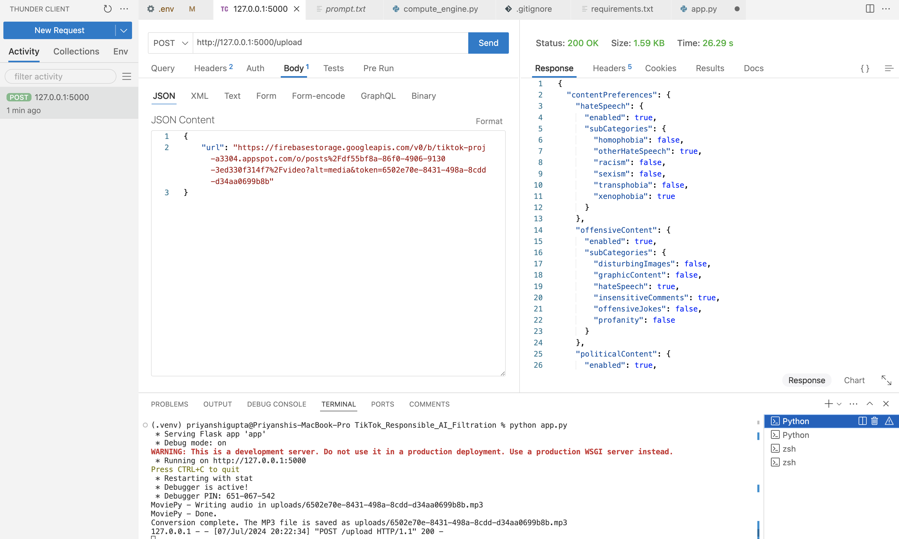

# TikTok_Responsible_AI_Filtration

## Overview

This application provides an API service to download a video from a URL, convert it to MP3, transcribe the audio using OpenAI's Whisper model, and return the transcription in JSON format using Anthropic's Claude model. Additionally, the application allows users to download the transcription as a text file.

## Features

- Download video from a given URL.
- Convert video to MP3 format.
- Transcribe audio using OpenAI's Whisper model.
- Generate JSON transcription using Anthropic's Claude model.
- Return transcription as a JSON response.
- Download transcription as a text file.
- Backend Support from: https://github.com/harjyotbagga/TikTokMask 

## Installation

### Prerequisites

- Python 3.8 or higher
- pip (Python package installer)
- FFmpeg (for video to audio conversion)

### Steps

1. Clone the repository:

    ```bash
    git clone git@github.com:sarthakg04/TikTok_Responsible_AI_Filtration.git
    cd your-repo
    ```

2. Create and activate a virtual environment:

    ```bash
    python -m venv venv
    source venv/bin/activate  # On Windows use `venv\Scripts\activate`
    ```

3. Install required packages:

    ```bash
    pip install -r requirements.txt
    ```

4. Set up environment variables by creating a `.env` file in the root directory of the project:

    ```ini
    API_KEY=your_openai_api_key
    ANTHROPIC_API_KEY=your_anthropic_api_key
    ```

5. Ensure FFmpeg is installed and available in your PATH.

## Usage

### Running the Application

```bash
python app.py
```

## API Endpoints

1. **Upload Video for Transcription**
   - **Endpoint:** `/upload`
   - **Method:** `POST`
   - **Request Body:** JSON with the following structure:
     ```json
     {
       "url": "video_url"
     }
     ```
   - **Response:** JSON with the transcription text or an error message.

2. **Download Transcription**
   - **Endpoint:** `/transcription/<filename>`
   - **Method:** `GET`
   - **Description:** Returns the transcription text file for the given filename.

3. **Get JSON Transcription**
   - **Endpoint:** `/getjson/<filename>`
   - **Method:** `GET`
   - **Description:** Returns the transcription in JSON format for the given filename.

## File Structure
```
.
├── app.py                  # Main application file
├── compute_engine.py       # Custom module for generating JSON from transcription
├── requirements.txt        # Required Python packages
├── .env                    # Environment variables
├── uploads/                # Directory to store downloaded videos and transcriptions
└── data/
    └── prompt.txt          # Prompt file for generating JSON

```
## Demo

**Warning:** These images are intended for sample purposes only. 

Here are some demo images showing the application in action:




## OUTPUT JSON FOR MASKING
```
{
  "contentPreferences": {
    "hateSpeech": {
      "enabled": true,
      "subCategories": {
        "homophobia": false,
        "otherHateSpeech": true,
        "racism": false,
        "sexism": false,
        "transphobia": false,
        "xenophobia": true
      }
    },
    "offensiveContent": {
      "enabled": true,
      "subCategories": {
        "disturbingImages": false,
        "graphicContent": false,
        "hateSpeech": true,
        "insensitiveComments": true,
        "offensiveJokes": false,
        "profanity": false
      }
    },
    "politicalContent": {
      "enabled": true,
      "subCategories": {
        "centrism": false,
        "electionCoverage": false,
        "extremism": true,
        "leftWing": false,
        "politicalDebates": false,
        "rightWing": true
      }
    },
    "racialContent": {
      "enabled": true,
      "subCategories": {
        "culturalAppropriation": false,
        "racialDiscrimination": true,
        "racialEquality": false,
        "racialHistory": true,
        "racistRemarks": false
      }
    },
    "religiousContent": {
      "enabled": true,
      "subCategories": {
        "atheism": false,
        "buddhism": false,
        "christianity": false,
        "hinduism": true,
        "interfaithDialogues": false,
        "islam": true
      }
    },
    "sexualityAndGenderIssues": {
      "enabled": true,
      "subCategories": {
        "feminism": false,
        "genderIdentity": false,
        "lgbtq+": false,
        "relationshipAdvice": false,
        "sexEducation": false,
        "sexualHealth": false
      }
    }
  }
}

```


## Acknowledgements

- [OpenAI Whisper model](https://github.com/openai/whisper) for speech recognition.
- [Anthropic Claude model](https://www.anthropic.com/claude) for natural language understanding and generation.
- [MoviePy](https://github.com/Zulko/moviepy) for video processing.


